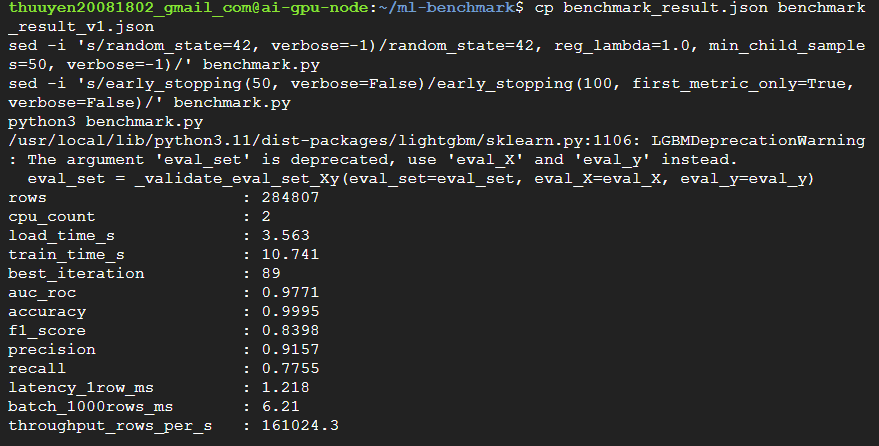
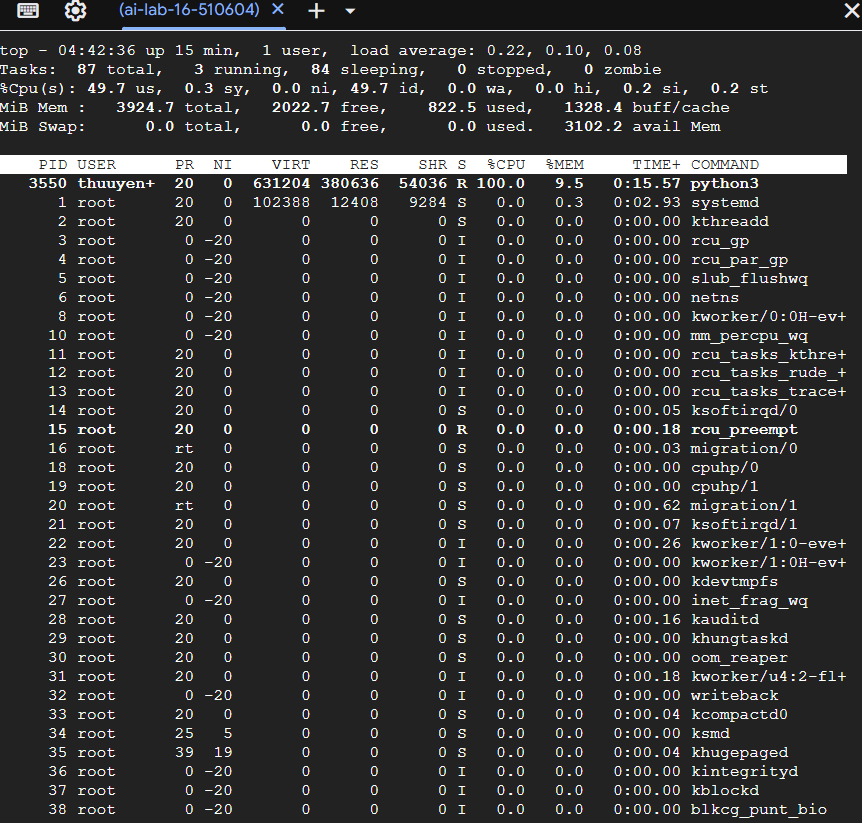
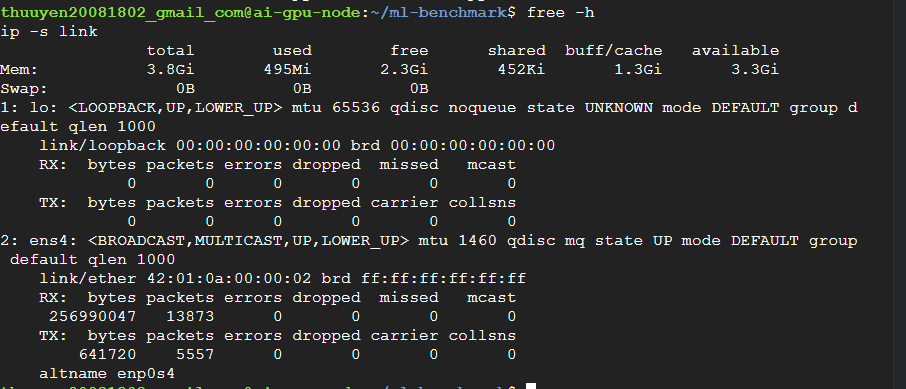
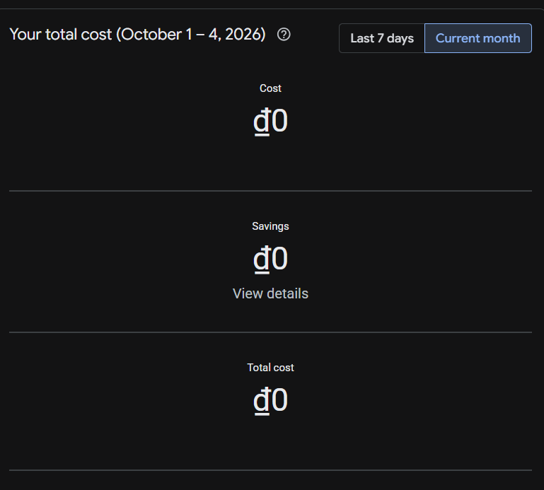
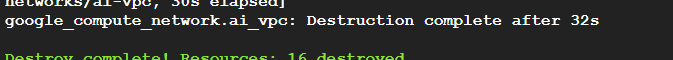

# Lab 16 — Cloud AI Environment Setup (Google Cloud Platform)

**Sinh viên:** BUI THI THU UYEN — **MSSV:** 2A202602613
**Cloud:** Google Cloud Platform (project `ai-lab-16-510604`, region `us-central1`)
**Lý do dùng GCP:** không đăng ký/xác thực được tài khoản AWS và Azure.

---

## 1. Hạ tầng (Terraform — thư mục `terraform-gcp/`)

- VPC `ai-vpc` + Private Subnet `10.0.0.0/24` (không có Public IP cho máy ảo).
- Cloud Router + Cloud NAT: cho máy ảo trong Private Subnet tải package/dataset từ internet.
- SSH qua Identity-Aware Proxy (IAP), không cần Bastion Host.
- Compute Node `ai-gpu-node`: `e2-medium` (2 vCPU / 4 GB RAM), Debian 12, cài sẵn LightGBM qua startup script.
- External HTTP Load Balancer trỏ vào port 8000 (health check "unhealthy" là bình thường ở luồng CPU vì không có service nào chạy ở port 8000).
- Terraform chạy từ Google Cloud Shell (Terraform v1.9.8).

**Thời gian triển khai (terraform apply):** bắt đầu 04:25:34 UTC — hoàn tất 04:29:33 UTC → khoảng 4 phút (3 phút 59 giây).

---

## 2. Kết quả benchmark LightGBM (Credit Card Fraud Detection)

Mã nguồn: [`benchmark.py`](benchmark.py) — kết quả: [`benchmark_result.json`](benchmark_result.json)

| Metric | Kết quả |
|---|---|
| Thời gian load data | 3.56 s |
| Thời gian training | 10.74 s |
| Best iteration | 89 |
| AUC-ROC | 0.9771 |
| Accuracy | 0.9995 |
| F1-Score | 0.8398 |
| Precision | 0.9157 |
| Recall | 0.7755 |
| Inference latency (1 row) | 1.22 ms |
| Inference throughput (1000 rows) | 6.21 ms (~161,000 rows/s) |

Thiết lập: train/test 80/20 (stratified), tách thêm 10% tập train làm validation cho early stopping theo AUC. `LGBMClassifier(n_estimators=1000, learning_rate=0.05, reg_lambda=1.0, min_child_samples=50)`.

---

## 3. Nhận xét

1. Toàn bộ 284,807 giao dịch được load trong 3.56 s; huấn luyện LightGBM chỉ mất 10.74 s (early stopping ở vòng 89) — CPU 2 nhân là đủ cho bài toán tabular cỡ này, không cần GPU.
2. Mô hình đạt AUC-ROC 0.977 và F1 0.84 (Precision 0.92, Recall 0.78).
3. Accuracy 99.95% không có nhiều ý nghĩa vì giao dịch gian lận chỉ chiếm 0.17% — một mô hình luôn đoán "không gian lận" cũng đạt ~99.8%. AUC và F1 là các chỉ số đáng tin hơn.
4. Lần chạy đầu không dùng regularization: mô hình dừng ở vòng 1 với AUC chỉ 0.927. Nguyên nhân là dữ liệu quá mất cân bằng khiến mỗi bước cập nhật của mô hình quá lớn, nên mô hình hỏng ngay sau cây đầu tiên. Thêm `reg_lambda=1.0` và `min_child_samples=50` đã khắc phục vấn đề này.
5. Dự đoán 1 dòng mất 1.22 ms (phần lớn là chi phí gọi hàm Python/pandas), trong khi dự đoán theo lô 1000 dòng chỉ mất 6.21 ms (~161K dòng/s) → khi triển khai thực tế nên dự đoán theo lô (batch inference).
6. Chi phí ước tính ~$0.09/giờ (Compute Engine + Cloud NAT + Load Balancer), được trừ vào credit Free Trial. Ảnh Billing Reports hiển thị ₫0 vì GCP cập nhật chi phí chậm vài giờ và phần phát sinh (chưa tới 1 giờ chạy) được trừ vào credit Free Trial. Tài nguyên đã được xóa bằng `terraform destroy` sau khi hoàn thành (16 resources destroyed).

---

## 4. Ảnh chụp màn hình

### 4.1. Chạy `python3 benchmark.py`

### 4.2. Tài nguyên: `top`, `free -h`, `ip -s link`

### 4.3. GCP Billing Reports

### 4.4. `terraform destroy` hoàn tất

